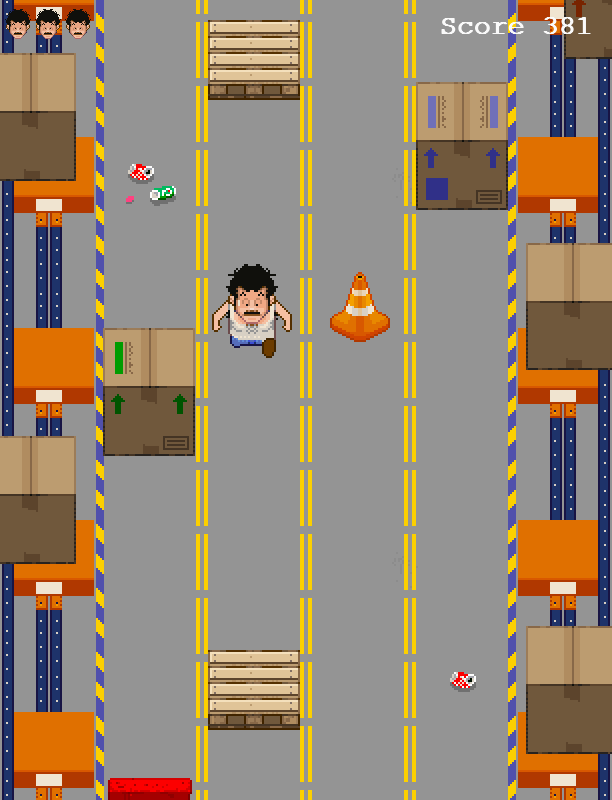

# Stocky Boy
Stocky Boy is a pygame developed for the [DevPost Pygames Hackathon 2023](https://pygames.devpost.com/). The game pays homage to the classic 8-bit games from the 1980s. Our goal was to create a game that is easy to pick up and play while remaining challenging and addictive. With retro-style graphics inspired by comic books and manga cartoons, coupled with music that transports players back to the golden age of gaming, Stocky Boy delivers an immersive nostalgic experience.




## Features
- Retro-style graphics and animations
- Simple and intuitive gameplay mechanics
- Music reminiscent of the golden age of gaming

## Installation
To get started, you'll need to install pygame and run the app.py file.

### Prerequisites
- Python 3.9
- pygame library

### Installation Steps
Clone the GitHub repository

```
git clone https://github.com/Alvaromah/stockyboy.git
```

Navigate to the project directory

```
cd stockyboy
```

Install the required pygame library

```
pip install pygame
```


Run the app.py file to start the game
```
python app.py
```

## Controls
- Arrow keys to move left and right
- Spacebar to jump

## Credits
- Code: Álvaro Mateos
- Graphics: Daniel Celemin
- Music: Juan Diego Triviño

## License
This project is licensed under the MIT License. See the LICENSE file for details.
